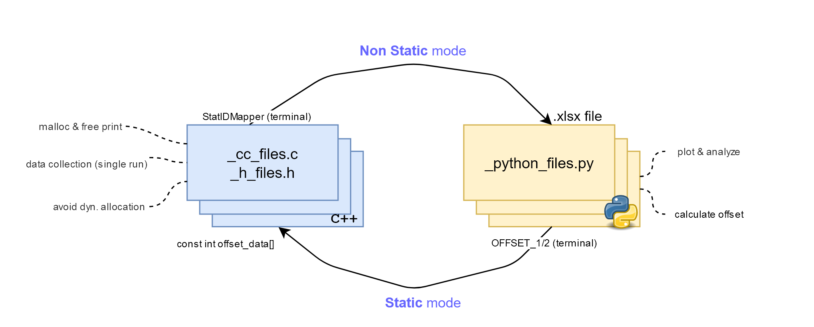

# Description 
A sum of python and C++ scripts to attach for embedded solutions on TFLite to analyze dynamic and avoid memory allocations, as decribed in this figure.


# Requirements
- newlib (modified and compiled with extra hook options) !update link to fork/downloadables!
- python (tested on 3.7) 
- Libre Office, or any _.xlsx_ file editor
- C++11 or newer.

# Who's who?
_/python_ : Python scripts to run and analyze data cought from the hooks running in a specific mode. **Read more inside**.

_/C_ : _.cc_ and _.h_ to include to enable custom malloc(), free() hooks on the C Library. **Read more inside**.

_pics_: Images used for README.md. (added to .gitignore)

_tflite_: Tensorflow Lite Micro (TFLite) optimized audio operators (MFCC and audio_spectrogram)


# Getting started
To start using the scripts, clone the repo to a local dir. 
1. Place the c files into your TFLlite's main.cpp dir. (**Complete CMakeLists.txt/Linker accordingly**)
2. Include the header files into your main.cpp to be used by the built TFLite bin.
3. (Optional) If also using the above mentioned TFLite ops, please copy the files into tf/tflite/micro/kernel/
4. Comment the line inside malloc_hook.h to start in _default_ mode: (If already done skip.)
```
#define _STATIC_MALLOC
```
5. Introduce memory hooks into main.cpp
6. Compile (preferably in DEBUG mode) and run.
7. Copy the important data into the clipboard. 
8. Use the python scripts in /python to analyze the memory data and generate offsets.
9. Copy the offsets into malloc_array.cc
10. Comment out the same line from step 4. to start in STATIC MODE.
11. Compile and run.
12. If uncontent with the results, repeat from step 4. 

**note**: Inside each folder is a more extensive README concerning each theme. Please read carefully. 
